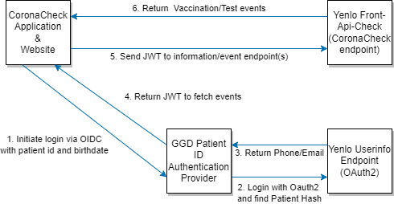

# GGD PatientID Auth Provider

GGD PatientID Auth Provider is an OAuth 2.0 [OIDC](https://openid.net/connect/) + [PKCE](https://tools.ietf.org/html/rfc7636) authentication provider for the alternative authentication route for users who can not use DigiD, as described in the provider docs ([Providing Vaccination / Test / Recovery / Assessment Events by Patient ID](https://github.com/minvws/nl-covid19-coronacheck-provider-docs/blob/main/docs/providing-events-by-patient-id.md)) and in the app coordination docs ([GGD PatientID Authentication Provider](https://github.com/minvws/nl-covid19-coronacheck-app-coordination/blob/main/architecture/GGD%20PatientID%20Authentication%20Provider.md)).



## Integrating in an app

If you are familiar with OIDC and PKCE this should be fairly straightforward. The authorization endpoint is `/oidc/authorize` and the token endpoint is `/oidc/accesstoken`. Only `response_type=code` with `scope=openid` is supported. PKCE is mandatory and only `code_challenge_method=S256` is supported.

For full integration instructions, see [INTEGRATING.md](documentation/INTEGRATING.md).

## Local installation & development

For local installation instructions, see [DEVELOPMENT.md](documentation/DEVELOPMENT.md).

# Production Installation

For production installation instructions, see [PRODUCTION.md](documentation/PRODUCTION.md).

# Certificate usage

There are 3 different X509 certificates used. Please see [CERTIFICATES.md](documentation/CERTIFICATES.md).

## Quick Start Configuration

See [.env.example](./.env.example).

Short list of some important variables.

```
APP_NAME=
APP_ENV=			                     # E.g. production
APP_KEY=                                 # Can be generated with `php artisan key:generate`
CODEGEN_HMAC_KEY=                        # HMAC key for patient hash generation function
CODEGEN_EXPIRY=900                       # Number of seconds before expiring authentication codes
SMS_GATEWAY_MESSAGEBIRD_API_KEY=         # Api key for message bird text messaging
OIDC_CLIENT_CONFIG_JSON=                 # Configuration file for oidc clients
CMS_X509_CERT=                           # Certificate for verifying Yenlo CMS signatures
CMS_X509_CHAIN=                          # Accompanying CA chain
```

