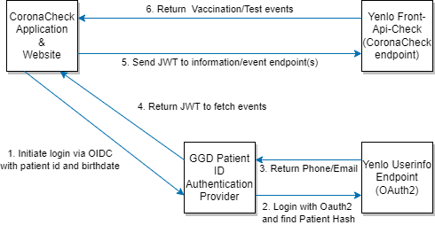

# Certificate use in GGD PAP
There are 3 different X509 certificates used in GGD PAP.

### TLS
In order to provide a secure connection, the webserver should be configured to use TLS/SSL. Setting this up requires an X509 certificate (and key) issued by a publicly available CA. Certificates of this type can be ordered online and should be configured in the webserver. *This is used in step 1.*

### CMS Verification
In order to verify the responses received from the UserInfo endpoint, the CMS signature must be checked. In order to check the signature, the public certificate and chain used to sign the data must be configured. The location of these files can be configured in the environment file as `CMS_X509_CERT` and `CMS_X509_CHAIN`. These are full paths to the files containing the certificates. *This is used in Step 3.*

### JWT Signature
The JWT issued by GGD-PAP is signed using a X509 certificate. The certificate and corresponding key must be configured in `./secrets/cert.pem` and `./secrets/jwt.key`. In production, this certificate should be different from the certificate used for TLS. *This is used in step 5.*
