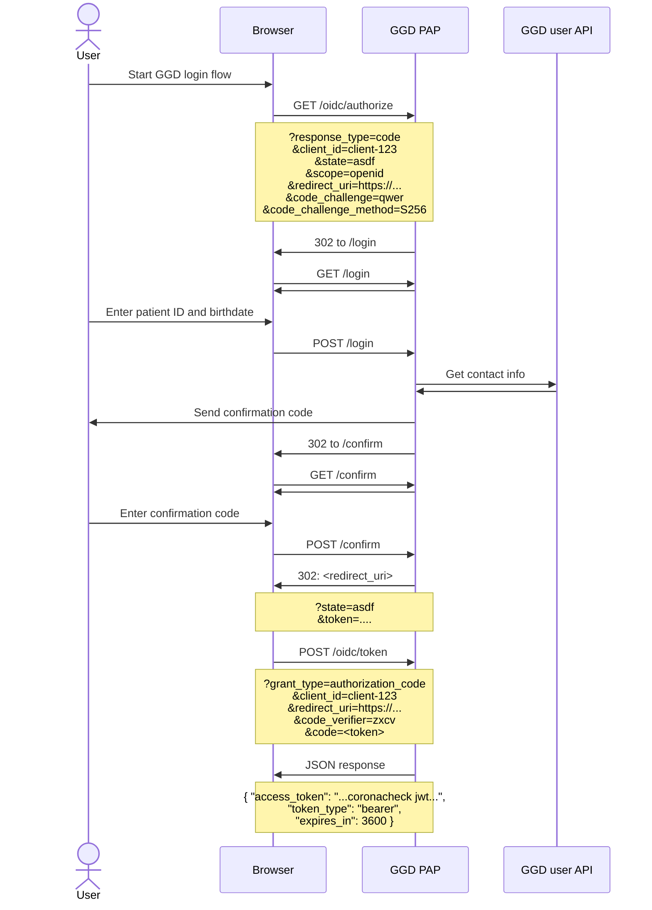

# Integrating GGD PatientID Auth Provider into an app

This app is an [OIDC](https://openid.net/connect/) + [PKCE](https://tools.ietf.org/html/rfc7636) authentication provider.

If you are unfamiliar with OIDC and PKCE, it is highly advised and try out the demo client app. If you follow the instruction in [DEVELOPMENT.md](DEVELOPMENT.md) to run the app with docker-compose, you can access the demo client app at [https://pap-demo-client.localdev:445](https://pap-demo-client.localdev:445).

## Authentication flow

The basic authentication flow from an app via GGD-PAP is as follows:



## `/oidc/authorize`

To start the authentication process, the app should redirect the user to `/oidc/authorize` with the following querystring params:

Param|Value
--|--
`response_type`|`code`
`client_id`|The client app's ID (must be configured in the auth provider)
`state`|Any string `[\x20-\x7E]+`, will be provided back to callback
`scope`|`openid`
`redirect_uri`|The client app's callback URI (must be configured in the auth provider)
`code_challenge`|See [Code challenge](#code-challenge)
`code_challenge_method`|`S256`

All params except `lang` are required.

If the authentication flow is completed **successfully**, the user is redirected to `{redirect_uri}?state={state}&code={code}` with a `code` that can be exchanged for an accesstoken via `/oidc/accesstoken`.

If the authentication flow is **cancelled** by the user, the user is redirected to `{redirect_uri}?state={state}&error=cancelled`.

If the authentication request is invalid, the user is shown an error message instructing them to go back to the application or website that redirected them and to try again.

## `/oidc/accesstoken`

After the user is successfully authenticated and redirected back, the client app can exchange the provided `code` for an access token by performing a `POST` request to `/oidc/accesstoken` with the following x-www-form-urlencoded params:

Param|Value
--|--
`grant_type`|`authorization_code`
`client_id`|The client app's ID (must match the one in the auth request)
`redirect_uri`|The client app's callback URI (must match the one in the auth request)
`code_verifier`|The code verifier that was used to calculate the `code_challenge` for the auth request (see [Code challenge](#code-challenge))
`code`|The `code` that was provided to the callback endpoint

## Code challenge

The `code_challenge` of the `/oidc/authorize` is derived from a `code_verifier` that the client app needs to remember and send along with the `/oidc/accesstoken` request.

The `code_verifier` must be a high-entropy cryptographically secure random string and must match `[a-zA-Z0-9._~-]{43,128}`.

The `code_challenge` is derived from the `code_verifier` like so:

```
url_safe_base64(sha256(ascii(code_verifier)))
```

Where `url_safe_base64` means a base64 encoding with `=` removed and with `+` replaced by `-` and `/` replaced by `_`, as described in [section 5 of rfc4648](https://tools.ietf.org/html/rfc4648#section-5).
